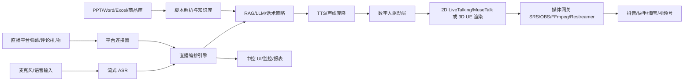

# AI 数字人直播系统方案与开发计划

## 1. 项目目标

建设一套可支持数字人定制、AI 直播驱动、直播中控、多平台推流、年度服务交付的系统。系统分为两条落地路径：

- **开源 MVP 路线**：优先跑通 AI 直播闭环，适合内部演示、产品验证、低成本试点。
- **商用/投标级路线**：在 MVP 架构上接入商业数字人 API、UE 3D 渲染、第三方检测和服务体系，满足招投标参数与客户验收。

核心能力包括：

- 数字人形象、声线、服装、动作和场景管理。
- 实时语音识别、口型同步、TTS 声线克隆、知识库问答。
- PPT、Word、Excel 脚本解析与直播流程联动。
- 抖音、快手、淘宝、视频号等平台推流和弹幕互动。
- 自动场控、弹幕过滤、智能回复、数据统计、月度报告。
- 年度授权、算法更新、故障排查、培训和 SLA 服务。

## 2. 总体架构



### 2.1 架构原则

- **模块解耦**：数字人渲染、TTS、ASR、LLM、平台推流均通过 Adapter 接入，避免供应商锁定。
- **实时优先**：直播链路以 WebSocket、WebRTC、RTMP、SRT 为主，管理链路使用 REST API。
- **可替换模型**：开源模型和商业 API 使用统一接口，后续可按成本、质量、合规要求切换。
- **合规接入平台**：直播平台弹幕、礼物、推流等能力优先使用官方开放平台或服务商能力。
- **可验收可审计**：关键指标保留日志、报表、检测材料、性能数据和操作记录。

## 3. 开发模块划分

## 3.1 数字人资产与定制模块

### 目标

管理数字人形象、3D 模型、2D 视频数字人、服装、发型、配饰、动作、表情、声线、检测报告等资产。

### 功能范围

- 数字人形象管理：创建、编辑、启用、禁用、预览。
- 模型资产管理：上传模型、贴图、骨骼、BlendShape、LOD、检测报告。
- 服装系统：多套服装、发型、配饰配置，支持预加载和实时切换。
- 表情系统：支持 ARKit 52 BlendShapes 或等效表情驱动清单。
- 动作库：基础站姿、讲解、指示、欢迎、告别、商品展示、应急静默。
- 声线绑定：一个数字人可绑定多个 voice_id，不同场景切换不同声线。
- 质检字段：面部三角面数、身体三角面数、贴图分辨率、表情数量、加载时间、检测报告编号。

### 技术选型

- MVP：LiveTalking + MuseTalk/Wav2Lip/Ultralight-Digital-Human。
- 3D 投标级：UE5 + MetaHuman/自定义扫描模型 + ARKit 52 BlendShapes + Live Link。
- 模型资产存储：MinIO/S3。
- 资产元数据：PostgreSQL。

### 交付物

- 数字人资产管理后台。
- 资产上传、预览、状态管理。
- 声线、服装、动作、表情绑定配置。
- 模型检测材料归档页面。

### 验收指标

- MVP：可选择数字人形象并在直播预览中驱动说话。
- 商用版：支持多形象、多声线、多服装切换。
- 投标级：可归档第三方检测报告，记录面部三角面数、身体三角面数和表情清单。

## 3.2 AI 直播驱动引擎模块

### 目标

完成实时语音识别、文本理解、知识库问答、话术生成、TTS 合成、口型同步和数字人驱动。

### 功能范围

- 流式 ASR：支持麦克风输入、平台音频输入、热词增强、标点恢复。
- 语义理解：识别观众问题、商品咨询、售后问题、风险问题、闲聊。
- RAG 问答：从行业知识库、商品库、脚本库、FAQ 中检索答案。
- 话术策略：根据直播阶段、平台、商品、用户类型生成回复。
- TTS 声线：支持声线克隆、本地合成、云 API 兜底。
- 口型驱动：TTS 音频驱动口型和表情。
- 打断机制：人工指令、高优先级问题、风险事件可打断当前播报。
- 延迟监控：记录 ASR、LLM、TTS、渲染、推流各环节耗时。

### 技术选型

- ASR：FunASR、SenseVoice。
- TTS/声线克隆：CosyVoice、GPT-SoVITS；商用兜底可接云厂商 TTS。
- LLM：Qwen、DeepSeek 或 OpenAI-compatible 云模型。
- 推理服务：vLLM 或云模型 API。
- RAG：Qdrant/Milvus/pgvector + Qwen Embedding/Reranker。
- 编排：FastAPI + Redis Queue/Celery/Arq。

### 交付物

- ASR 流式接口。
- RAG 问答接口。
- TTS 合成接口。
- 数字人 speak/interrupt API。
- 延迟统计和链路追踪日志。

### 验收指标

- MVP：输入文本后数字人可在预览窗口播报。
- MVP：弹幕模拟器输入问题后，AI 可基于知识库回复。
- 商用版：支持热词、风险过滤、优先级队列和人工接管。
- 投标级：按客户测试集出 ASR 准确率、问答响应时间、TTS MOS 相关验收材料。

## 3.3 脚本解析与直播编排模块

### 目标

将 PPT、Word、Excel、商品表、FAQ 等文件解析为直播脚本、场景、动作、话术和知识库内容。

### 功能范围

- PPT 解析：读取幻灯片标题、正文、备注、图片，生成直播流程节点。
- Word 解析：按章节、标题、表格、重点字段生成讲解脚本。
- Excel 解析：读取商品 SKU、价格、库存、卖点、禁用词、优惠策略。
- 脚本标记：支持场景切换、动作触发、商品展示、平台范围、风险等级。
- 时间线编排：拖拽排序、暂停、跳转、循环、插入互动问答。
- 脚本预演：未开播前模拟数字人口播和场景切换。

### 推荐脚本标记示例

```text
[scene:product_intro]
[action:welcome]
[avatar:avatar_001]
[voice:voice_001]
[product:sku_10001]
[risk:normal]
欢迎大家来到直播间，今天我们重点介绍这款产品。
```

### 技术选型

- 文档解析：unstructured、python-pptx、python-docx、openpyxl、LibreOffice headless、Apache Tika。
- 脚本结构化：FastAPI Worker + PostgreSQL。
- 文件存储：MinIO/S3。

### 交付物

- 文件上传和解析页面。
- 脚本结构化结果预览。
- 直播 timeline 编辑器。
- 脚本与知识库同步入库能力。

### 验收指标

- 支持 PPT、Word、Excel 上传解析。
- 可从解析结果生成直播流程。
- 可手动调整流程并保存为直播模板。

## 3.4 AI 直播中控模块

### 目标

为运营人员提供直播控制台，实现数字人预览、开播控制、弹幕管理、AI 回复、场景切换和人工接管。

### 功能范围

- 开播控制：创建直播任务、选择平台、选择数字人、选择脚本、启动/停止推流。
- 实时预览：WebRTC/FLV/HLS 预览数字人画面和音频。
- 弹幕流：展示评论、问题、点赞、礼物、用户标签。
- 智能回复：AI 自动生成回复，支持自动播报或人工确认。
- 弹幕过滤：敏感词、广告、刷屏、辱骂、竞品词、合规风险。
- 场景切换：商品讲解、福利、问答、休息、应急、人工接管。
- 播报队列：查看当前播报、待播报、已播报、失败重试。
- 应急控制：一键静音、一键停播、一键切人工、一键禁用 AI。
- 数据面板：在线人数、互动量、回复量、转化点击、推流状态、延迟。

### UI 设计方向

- 风格：直播播控室，而不是普通后台模板。
- 色彩：石墨灰、钨金橙、信号绿、风险红。
- 布局：顶部状态栏，中间大预览，右侧弹幕和回复，底部脚本时间线。
- 字体：中文建议阿里巴巴普惠体/鸿蒙 Sans，数字状态可使用 Barlow Condensed。
- 动效：开播检查逐项点亮、场景切换 broadcast wipe、风险告警闪烁但不打扰主流程。

### 页面规划

- 首页总览：当前直播、推流健康、AI 延迟、风险告警、今日数据。
- 直播中控：直播预览、弹幕、回复、播报队列、场景、时间线。
- 数字人资产：形象、服装、动作、声线、检测报告。
- 话术库：行业模板、商品话术、FAQ、禁用词、合规规则。
- 知识库：文档上传、解析、分块、向量化、问答测试。
- 平台管理：账号授权、推流地址、回调配置、弹幕权限。
- 报表中心：直播复盘、互动统计、故障统计、服务月报。
- 系统设置：用户、角色、权限、模型配置、API Key、SLA 配置。

### 技术选型

- 前端：Next.js/React + TypeScript。
- 状态管理：Zustand。
- 数据请求：TanStack Query。
- 组件：可基于 shadcn/ui 或自研播控组件。
- 图表：ECharts/AntV。
- 实时通信：WebSocket + WebRTC Player。

### 交付物

- 中控前端原型。
- 直播控制台核心页面。
- 弹幕模拟器。
- 人工接管和应急控制。
- 数据统计看板。

### 验收指标

- 运营人员能通过 UI 完成一次直播流程。
- 可看到实时预览、弹幕、AI 回复、播报队列和推流状态。
- 出现风险内容时可人工确认或拦截。

## 3.5 平台连接与多平台推流模块

### 目标

统一管理抖音、快手、淘宝、视频号等平台的推流地址、直播状态、弹幕数据和互动事件。

### 功能范围

- 平台账号管理：授权、绑定、启用、禁用、权限状态。
- 推流配置：RTMP/SRT/WebRTC 推流地址、密钥、安全存储。
- 多平台转推：同一直播内容同步推送到多个平台。
- 平台事件：评论、弹幕、点赞、礼物、关注、下单线索等。
- 平台失败隔离：单个平台断流不影响其他平台。
- 重连机制：自动重连、失败告警、人工重试。

### 技术选型

- 媒体网关：SRS 优先；OvenMediaEngine 备选但需注意 AGPL 许可。
- 转推：FFmpeg tee、OBS、Restreamer。
- 协议：RTMP、SRT、WebRTC、HLS/FLV 预览。
- 平台接入：官方开放平台 API 或服务商能力。

### 平台接入优先级建议

1. 抖音：优先，因为直播开放能力和弹幕互动文档相对完整。
2. 快手：需要确认企业开发者资质和接口开放情况。
3. 淘宝：结合电商直播场景和商品库优先级接入。
4. 视频号：优先支持推流，弹幕/互动需要按官方或服务商能力确认。

### 交付物

- 平台 Adapter 接口。
- 推流任务管理。
- 弹幕事件标准化。
- 多平台推流状态监控。

### 验收指标

- 支持至少一个平台真实推流。
- 支持多平台推流模拟或真实转推。
- 支持平台事件进入统一弹幕流。

## 3.6 知识库与话术库模块

### 目标

建设行业知识库、商品知识库、直播话术库、风险规则库，为 AI 回复和直播脚本提供内容基础。

### 功能范围

- 知识库管理：上传、解析、分块、向量化、发布、下线。
- 商品库：SKU、价格、库存、卖点、优惠、售后、禁答内容。
- 话术库：电商、教育、金融、通用欢迎、促单、答疑、收尾话术。
- 模板库：不少于 1000 条话术模板，可按行业、场景、平台分类。
- 风险规则：敏感词、禁用词、合规规则、行业黑名单。
- 问答测试：输入问题，查看召回文档、答案、置信度和风险判断。

### 技术选型

- 数据库：PostgreSQL。
- 向量库：Qdrant/Milvus/pgvector。
- Embedding：Qwen Embedding、bge-m3。
- Reranker：Qwen Reranker、bge-reranker。

### 交付物

- 知识库管理页面。
- 话术库 CRUD。
- 风险规则配置。
- RAG 测试台。

### 验收指标

- 可导入行业文档和商品表。
- AI 回复可引用知识库内容。
- 风险命中时可进入人工确认队列。

## 3.7 报表、监控与年度服务模块

### 目标

支持系统运行监控、直播复盘、月度服务报告、版本更新、培训和 SLA 记录。

### 功能范围

- 直播报表：开播时长、平台、互动量、问题量、AI 回复量、人工接管次数。
- 技术监控：ASR 延迟、LLM 延迟、TTS 延迟、渲染帧率、推流码率、丢帧。
- 故障管理：故障等级、处理人、响应时间、处理时长、根因分析。
- 年度服务：授权状态、算法更新、季度优化、培训记录、月度报告。
- 告警：推流中断、模型异常、延迟过高、磁盘不足、GPU 显存不足。

### 技术选型

- 指标：Prometheus + Grafana。
- 日志：Loki/ELK。
- 业务统计：ClickHouse/TimescaleDB 或 PostgreSQL 分区表。
- 报告：后端生成 PDF/Docx，后台下载。

### 交付物

- 直播复盘页面。
- 服务月报生成。
- SLA 工单记录。
- 监控与告警面板。

### 验收指标

- 每月可导出系统运行状态报告。
- 可追踪故障响应时间和处理记录。
- 可记录每季度系统更新与模型优化。

## 3.8 系统管理与权限模块

### 目标

提供多用户、多角色、多租户、审计、安全配置能力。

### 功能范围

- 用户管理：新增、禁用、重置密码、MFA 可选。
- 角色权限：管理员、运营、技术支持、审核员、只读用户。
- 租户隔离：客户、直播间、数字人资产、知识库隔离。
- API Key 管理：模型服务、平台服务、第三方 API 密钥加密存储。
- 操作审计：开播、停播、删除、授权、修改话术、人工接管等操作记录。

### 技术选型

- 认证：JWT + Refresh Token；后续可接企业 SSO。
- 权限：RBAC。
- 密钥：数据库加密字段或 Vault/KMS。

### 交付物

- 登录和权限系统。
- 用户角色管理。
- 操作审计日志。
- API Key 配置中心。

## 4. API 接口草案

### 4.1 直播会话接口

```http
POST /api/v1/live/sessions
GET  /api/v1/live/sessions/{id}
POST /api/v1/live/sessions/{id}/start
POST /api/v1/live/sessions/{id}/stop
POST /api/v1/live/sessions/{id}/say
POST /api/v1/live/sessions/{id}/interrupt
POST /api/v1/live/sessions/{id}/switch-scene
WS   /api/v1/live/sessions/{id}/events
```

### 4.2 数字人与声线接口

```http
POST /api/v1/avatars
GET  /api/v1/avatars
GET  /api/v1/avatars/{id}
POST /api/v1/avatars/{id}/outfits
POST /api/v1/avatars/{id}/actions
POST /api/v1/avatars/{id}/calibrate-blendshapes
POST /api/v1/voices/clone
GET  /api/v1/voices
```

### 4.3 AI 能力接口

```http
POST /api/v1/asr/stream-token
POST /api/v1/tts/synthesize
POST /api/v1/llm/chat
POST /api/v1/rag/query
POST /api/v1/moderation/check
```

### 4.4 知识库与脚本接口

```http
POST /api/v1/knowledge/import
GET  /api/v1/knowledge
POST /api/v1/scripts/parse
GET  /api/v1/scripts/{id}
POST /api/v1/scripts/{id}/publish
```

### 4.5 平台与报表接口

```http
POST /api/v1/platforms/{platform}/bind
POST /api/v1/platforms/{platform}/push-config
GET  /api/v1/platforms/{platform}/events
GET  /api/v1/reports/live/{session_id}
GET  /api/v1/reports/monthly
```

## 5. 部署规划

## 5.1 MVP 单机部署

适合验证和演示。

### 服务组成

- frontend：中控 UI。
- api：FastAPI 后端。
- postgres：业务数据库。
- redis：队列和实时状态。
- qdrant：向量库。
- minio：模型、文档、音视频资产。
- srs：媒体网关。
- ai-worker：ASR/TTS/LLM/RAG worker。
- avatar-worker：LiveTalking/MuseTalk 数字人驱动。

### 机器建议

- CPU：16 核以上。
- 内存：64GB 以上。
- GPU：24GB 显存起步更稳。
- 磁盘：NVMe SSD，至少 1TB。
- 系统：开发环境可 Linux/macOS，生产 AI 节点建议 Linux + NVIDIA CUDA。

## 5.2 生产部署

### 服务拆分

- Web/API 节点：运行中控、接口、权限、业务逻辑。
- AI 推理节点：ASR、TTS、LLM、Embedding、Reranker。
- 数字人渲染节点：LiveTalking 或 UE 渲染服务。
- 媒体网关节点：SRS/Restreamer/FFmpeg 转推。
- 数据节点：PostgreSQL、Redis、Qdrant、MinIO、ClickHouse。
- 监控节点：Prometheus、Grafana、Loki。

### Windows 要求对应

- 中控和平台服务可支持 Windows Server 2019 或更高版本。
- 3D 渲染节点可支持 Windows 10/11 或 Windows Server。
- AI 推理节点建议 Linux 优先，若客户要求 Windows Server，需要单独验证 CUDA、PyTorch、模型依赖兼容性。

## 6. 开发进度计划

## 6.1 阶段 0：需求确认与技术验证

### 周期

1 周。

### 目标

明确 MVP 范围、平台优先级、数字人路线、是否接商业 API、硬件预算和验收指标。

### 工作内容

- 确认优先平台：抖音、快手、淘宝、视频号顺序。
- 确认数字人形态：2D 视频数字人、3D 数字人或混合。
- 确认模型路线：开源私有化、商业 API 或混合。
- 确认部署环境：单机、内网服务器、云服务器、GPU 工作站。
- 搭建技术 PoC 清单和验收标准。

### 交付物

- 需求确认表。
- MVP 范围说明。
- 技术风险清单。
- 第一版系统架构图。

## 6.2 阶段 1：基础工程与核心 PoC

### 周期

1-2 周。

### 目标

跑通从文本输入到数字人播报，再到预览/推流的最小链路。

### 工作内容

- 初始化前后端项目结构。
- 搭建 Docker Compose 基础环境。
- 接入 LiveTalking/MuseTalk 或选定的数字人引擎。
- 接入 TTS 合成。
- 接入 SRS/RTMP/WebRTC 预览。
- 建立基础直播 session API。

### 交付物

- 可启动的开发环境。
- 文本驱动数字人播报 PoC。
- Web 页面预览数字人画面。
- 单路 RTMP 推流验证。

### 里程碑

- M1：输入一句话，数字人可生成音频、口型和视频预览。

## 6.3 阶段 2：AI 问答与知识库

### 周期

2-3 周。

### 目标

实现基于知识库的弹幕问答和话术生成。

### 工作内容

- 接入 FunASR/SenseVoice 流式识别。
- 接入 LLM 服务，支持 OpenAI-compatible API。
- 搭建 Qdrant/Milvus/pgvector 向量库。
- 完成文档导入、分块、Embedding、检索、重排。
- 建立问答策略、风险过滤和人工确认流程。
- 做弹幕模拟器。

### 交付物

- 知识库导入和测试页面。
- 弹幕模拟器。
- RAG 问答接口。
- AI 回复队列。

### 里程碑

- M2：输入弹幕问题，系统可从知识库检索并驱动数字人回复。

## 6.4 阶段 3：直播中控 MVP

### 周期

3-5 周。

### 目标

完成运营可使用的中控台，支持一场完整模拟直播。

### 工作内容

- 完成首页总览和直播控制台 UI。
- 实现开播、停播、播报、打断、场景切换。
- 实现弹幕流、AI 回复、人工确认、风险拦截。
- 实现脚本 timeline 基础能力。
- 实现数字人、声线、知识库、平台配置基础管理。
- 完成基础数据统计。

### 交付物

- 中控台 MVP。
- 直播任务管理。
- 场景和脚本时间线。
- 人工接管和应急控制。

### 里程碑

- M3：运营人员可通过中控完成一次 30 分钟模拟直播。

## 6.5 阶段 4：脚本解析与话术库

### 周期

2-4 周。

### 目标

支持 PPT、Word、Excel 自动解析，并形成直播脚本和知识库。

### 工作内容

- 完成 PPT/Word/Excel 上传和解析。
- 建立结构化脚本模型。
- 建立话术模板库，支持行业分类和场景分类。
- 导入不少于 1000 条话术模板。
- 脚本与场景、动作、商品、平台联动。
- 支持脚本预演。

### 交付物

- 脚本解析服务。
- 话术库管理页面。
- 直播流程模板。
- 脚本预演能力。

### 里程碑

- M4：上传 PPT/Word/Excel 后可自动生成可编辑直播流程。

## 6.6 阶段 5：真实平台接入与多平台推流

### 周期

3-6 周，受平台资质和审核影响。

### 目标

接入至少一个真实直播平台，并完成多平台推流能力。

### 工作内容

- 完成平台 Adapter 标准接口。
- 接入第一个目标平台的推流和弹幕能力。
- 支持多个平台推流地址配置。
- 实现平台事件标准化。
- 实现断流重连、失败隔离、告警。
- 接入 OBS/FFmpeg/Restreamer/SRS 转推链路。

### 交付物

- 平台管理页面。
- 多平台推流任务。
- 平台弹幕事件接入。
- 推流健康监控。

### 里程碑

- M5：完成至少一个平台真实开播和弹幕互动闭环。

## 6.7 阶段 6：报表、监控与年度服务

### 周期

2-4 周。

### 目标

补齐商用运维、服务报告、SLA、培训和月报能力。

### 工作内容

- 接入 Prometheus/Grafana/Loki。
- 建立直播复盘报表。
- 建立系统运行月报。
- 建立故障工单和 SLA 记录。
- 建立版本更新记录和培训记录。
- 增加客户服务相关后台页面。

### 交付物

- 直播复盘报表。
- 月度服务报告。
- SLA 工单页面。
- 培训和版本更新记录。

### 里程碑

- M6：可导出客户月度运行报告，支持年度服务交付材料。

## 6.8 阶段 7：投标级 3D 能力增强

### 周期

4-12 周，取决于 3D 建模、动捕和检测周期。

### 目标

满足高精度 3D 数字人、52+ 微表情、实时动捕、4K HDR 渲染等投标级能力。

### 工作内容

- 3D 扫描和高模制作。
- 建立实时渲染低模和 LOD 流程。
- 完成 ARKit 52 BlendShapes 或等效表情系统。
- 接入面捕和全身动捕。
- 接入 UE5 渲染节点和 Pixel Streaming/OBS/NDI 输出。
- 做 4K 30fps HDR 渲染和推流验证。
- 整理第三方检测报告和投标材料。

### 交付物

- 3D 数字人渲染节点。
- 表情和动作驱动能力。
- 4K HDR 输出能力。
- 检测报告归档材料。

### 里程碑

- M7：完成投标级数字人指标演示和检测材料归档。

## 7. 风险与应对

| 风险 | 影响 | 应对 |
| --- | --- | --- |
| 开源数字人画质不足 | 影响客户观感和投标参数 | MVP 使用开源，商用接数字人 API 或 UE 3D 渲染 |
| 平台弹幕 API 权限受限 | 影响互动闭环 | 优先申请官方权限，提供弹幕模拟器和服务商接入方案 |
| 端到端延迟过高 | 影响实时互动 | 使用流式 ASR/LLM/TTS，缓存高频问答，拆分 AI 和渲染节点 |
| TTS MOS 难达标 | 影响验收 | 使用商用 TTS 兜底，建立听测集和主观评估流程 |
| 3D 高模无法实时渲染 | 影响 4K 直播 | 高模用于检测，实时渲染使用低模 LOD 和法线/贴图还原 |
| Windows Server 运行 AI 依赖复杂 | 影响部署稳定性 | 业务服务兼容 Windows，AI 推理建议独立 Linux GPU 节点 |
| 平台合规风险 | 影响上线 | 禁止逆向抓取，优先官方 API/服务商能力，保留操作审计 |
| 多模型运维复杂 | 影响服务稳定 | 模型服务容器化，统一健康检查、版本管理和回滚 |

## 8. 推荐优先级

### 第一优先级

- 直播中控 MVP。
- 文本/TTS 驱动数字人播报。
- 弹幕模拟器和知识库问答。
- 单平台 RTMP 推流。
- 人工接管和风险过滤。

### 第二优先级

- PPT/Word/Excel 脚本解析。
- 话术库和商品库。
- 多平台推流。
- 平台真实弹幕接入。
- 直播复盘报表。

### 第三优先级

- 3D 数字人资产管理。
- 52+ 微表情和全身动捕。
- 4K HDR 渲染。
- 第三方检测报告流程。
- 年度服务和 SLA 完整闭环。

## 9. 待确认事项

1. 第一版是优先做开源 MVP，还是直接按投标级 3D 数字人做？
2. 数字人形态优先 2D 真人视频数字人，还是 3D 超写实数字人？
3. 平台接入优先级是抖音、快手、淘宝、视频号中的哪一个？
4. 是否允许使用商业 API 作为数字人/TTS/ASR 兜底？
5. 目标部署环境是单机 GPU 工作站，还是分 AI 节点、渲染节点、媒体节点？
6. 是否需要先做可演示版本，再补投标参数和检测报告？

## 10. 建议下一步

确认以上待确认事项后，进入阶段 1：基础工程与核心 PoC。建议先初始化如下目录：

```text
apps/
  web/              # 中控前端
  api/              # 后端 API
services/
  ai-worker/        # ASR/TTS/LLM/RAG worker
  avatar-worker/    # 数字人驱动 worker
  media-gateway/    # SRS/FFmpeg/推流配置
packages/
  shared/           # 前后端共享类型
  adapters/         # 平台和模型 Adapter
docs/
  digital-human-live-system-plan.md
infra/
  docker-compose.yml
  monitoring/
```
