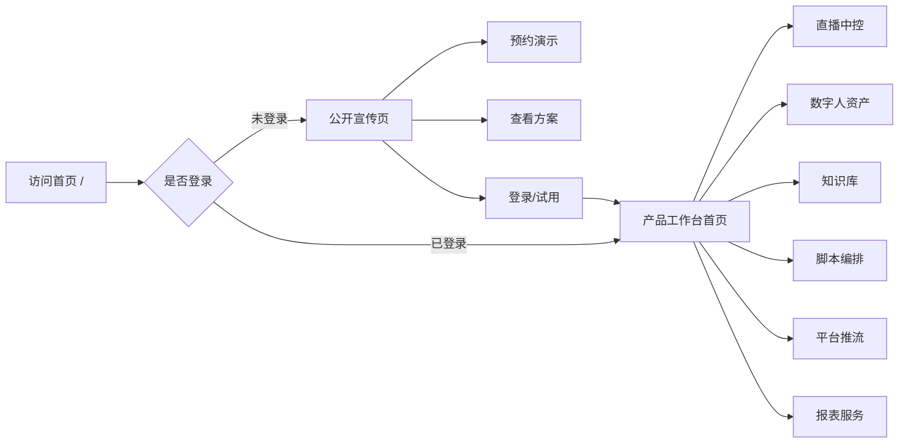

# 宣传页官网与功能模块入口规划

## 1. 目标定位

系统需要先有一个对外展示的宣传页官网，用来说明产品价值、展示核心功能模块，并作为进入系统各功能模块的统一入口。

这个官网不是简单的企业官网，也不是单纯后台首页，而应该是：

- 对外：展示 AI 数字人直播系统的能力、行业方案、案例、服务和部署方式。
- 对内：登录后成为产品工作台首页，可以从功能模块卡片直接进入对应业务模块。
- 对销售：支持客户演示、预约试用、下载方案、查看投标级能力说明。
- 对运营：让用户一眼知道从哪里开始：创建直播、创建数字人、上传脚本、接入平台、查看报表。

## 2. 产品首页形态

建议采用“双层首页”设计：

1. **公开官网首页**：未登录用户看到，重点宣传、转化、预约演示。
2. **登录后工作台首页**：已登录用户看到，重点进入功能、查看状态、继续任务。

两者视觉风格保持一致，但内容重点不同。



## 3. 对标产品参考

## 3.1 海外 AI 数字人和视频平台

| 产品 | 参考地址 | 可学习点 |
| --- | --- | --- |
| HeyGen | https://www.heygen.com/ | 首页直接强调 AI Avatar、视频生成、模板和 API，视觉上产品能力很直观。 |
| Synthesia | https://www.synthesia.io/ | 企业级 AI 视频平台表达清晰，适合参考“功能、场景、企业可信度”的组织方式。 |
| D-ID | https://www.d-id.com/ | 强调自助式 Studio、会说话的 Avatar、AI Agent，适合参考轻量创建流程。 |
| Tavus | https://www.tavus.io/ | 强调实时视频 Agent 和人机面对面对话，适合参考“实时、低延迟、会看会听会说”的产品叙事。 |
| Captions | https://captions.ai/ | 适合参考年轻化、视频感、轻量创作工具的宣传页节奏。 |
| Runway | https://runwayml.com/ | 适合参考高级 AI 视频产品的视觉冲击力和模块化产品展示。 |

## 3.2 直播中控和多平台推流

| 产品 | 参考地址 | 可学习点 |
| --- | --- | --- |
| StreamYard | https://streamyard.com/ | 参考浏览器直播间、嘉宾、聊天、品牌元素和开播流程表达。 |
| Restream | https://restream.io/ | 参考多平台目的地、统一聊天、转推状态和多平台价值表达。 |
| OBS Studio | https://obsproject.com/ | 参考专业播控概念：场景、来源、音频、推流状态，但我们要降低操作复杂度。 |
| Streamlabs | https://streamlabs.com/ | 参考主播工具、告警、叠加层、互动数据的产品组织。 |

## 3.3 国内数字人和云服务平台

| 产品 | 参考地址 | 可学习点 |
| --- | --- | --- |
| 腾讯云数字人 | https://avatar.cloud.tencent.com/ | 参考数字人视频创作、素材、渲染和发布流程。 |
| 腾讯云智能数智人 | https://www.tencentcloud.com/zh/products/ivh | 参考虚拟形象播报、实时语音交互、3D 数字人的企业级表达。 |
| 百度智能云曦灵 | https://xiling.cloud.baidu.com/ | 参考电商营销、短视频、AI 直播、数字员工的业务场景组织。 |
| 阿里云虚拟数字人 | https://www.aliyun.com/product/ai/avatar | 参考 2D/3D 数字人、视频合成、实时交互和直播场景说明。 |
| 华为云 MetaStudio | https://www.huaweicloud.com/product/mdh.html | 参考数字人视频制作、直播、智能交互和企业代言的商业表达。 |

## 4. 官网核心叙事

建议首页不要从技术参数开始讲，而是从客户最关心的问题开始：

- 没有主播也能稳定开播。
- 知识库和商品库自动驱动讲解。
- 弹幕问题自动识别、过滤、回答。
- 一套中控同时管理数字人、脚本、推流、报表和服务。
- 可从开源 MVP 升级到商用 API 或投标级 3D 数字人。

推荐主标题方向：

```text
AI 数字人直播中控平台
让数字人从“会说话”升级为“会直播、会互动、会转化”
```

备选标题：

```text
一站式 AI 数字人直播系统
从数字人定制、脚本编排到多平台推流，统一中控完成
```

```text
面向电商、教育、金融的 AI 数字人直播解决方案
自动讲解、智能问答、弹幕场控、数据复盘，全流程闭环
```

## 5. 公开官网页面结构

## 5.1 顶部导航

```text
Logo
产品能力
解决方案
数字人定制
AI 直播中控
客户案例
价格/部署
文档
登录
预约演示
```

### 导航说明

- 产品能力：锚点跳转到核心模块介绍。
- 解决方案：电商、教育、金融、政企宣传、文旅讲解等行业页。
- 数字人定制：介绍 2D/3D、声线、服装、动作、检测报告。
- AI 直播中控：重点介绍真正的操作台。
- 价格/部署：SaaS、私有化、投标级定制、年度服务。
- 登录：进入系统。
- 预约演示：销售转化入口。

## 5.2 Hero 首屏

### 内容

- 左侧：主标题、副标题、核心 CTA、可信标签。
- 右侧：产品动态预览，不建议只放静态插画。

### 首屏建议元素

- 数字人直播画面预览。
- 右侧滚动弹幕。
- AI 正在生成回复的状态。
- 多平台推流状态灯。
- 底部脚本 timeline。
- 延迟指标小卡片：ASR、LLM、TTS、渲染、推流。

### CTA

- 主按钮：预约演示。
- 次按钮：进入控制台 / 查看产品架构。
- 第三入口：下载方案 PDF。

### Hero 文案示例

```text
AI 数字人直播中控平台
从数字人、知识库、脚本到多平台推流，一套系统完成直播自动化。

支持数字人定制、实时问答、弹幕场控、PPT/Word/Excel 脚本解析、抖音/快手/淘宝/视频号推流。
```

## 5.3 痛点区

建议用 4 张问题卡片：

1. 主播成本高，排班难，直播稳定性差。
2. 商品和行业知识复杂，人工主播容易说错。
3. 多平台弹幕难管理，回复慢，风险内容难拦截。
4. 直播结束后没有完整数据复盘和服务报告。

每个痛点对应一个解决能力：

1. 数字人 7x24 稳定开播。
2. 知识库和脚本驱动讲解。
3. AI 中控自动场控和人工确认。
4. 报表、SLA、月度服务闭环。

## 5.4 核心功能模块区

这是首页最重要的区域。每个模块都是一张大功能卡，用户点击后可进入对应模块。

| 模块 | 宣传页说明 | 登录后入口 |
| --- | --- | --- |
| 数字人定制 | 形象、声线、服装、动作、表情、检测报告统一管理 | `/app/avatars` |
| AI 直播中控 | 开播、停播、弹幕、AI 回复、场景切换、人工接管 | `/app/live` |
| 脚本编排 | PPT/Word/Excel 自动解析，生成直播流程和时间线 | `/app/scripts` |
| 知识库问答 | 行业知识、商品库、FAQ、话术库驱动实时回答 | `/app/knowledge` |
| 平台推流 | 抖音、快手、淘宝、视频号多平台推流和状态监控 | `/app/platforms` |
| 场控与风控 | 弹幕过滤、敏感词、风险回复人工确认 | `/app/moderation` |
| 数据报表 | 直播复盘、互动数据、AI 回复质量、月度报告 | `/app/reports` |
| 年度服务 | 授权、算法更新、故障工单、培训和 SLA 记录 | `/app/services` |

### 模块卡设计

每张卡片建议包含：

- 模块名称。
- 一句话价值说明。
- 3 个关键能力标签。
- 一张微型界面截图或动态图。
- CTA：了解详情 / 进入模块。

示例：

```text
AI 直播中控
像操作直播导播台一样控制数字人直播。

能力：实时预览 / 弹幕问答 / 人工接管
按钮：进入直播中控
```

## 5.5 产品工作流区

用横向流程图说明系统如何工作：

```text
创建数字人 → 导入脚本/商品库 → 选择直播平台 → AI 自动讲解 → 弹幕实时互动 → 数据复盘报告
```

建议做成可交互步骤：鼠标悬浮每一步，右侧展示对应界面。

## 5.6 行业解决方案区

建议先做 4 个行业卡片：

| 行业 | 主要卖点 | 核心模块 |
| --- | --- | --- |
| 电商直播 | 商品讲解、促单话术、优惠提醒、售后问答 | 商品库、话术库、弹幕互动、多平台推流 |
| 教育培训 | 课程讲解、课件解析、学员问答、复盘报告 | PPT 解析、知识库、数字讲师、互动问答 |
| 金融服务 | 合规话术、产品说明、风险提示、人工审核 | 风控审核、知识库、审计、人工确认 |
| 政企宣传 | 政策宣讲、展厅讲解、多语种讲解、服务报告 | 数字人定制、脚本编排、报表服务 |

## 5.7 产品能力对比区

建议做三档能力，不直接说价格：

| 版本 | 适合场景 | 核心能力 |
| --- | --- | --- |
| MVP 验证版 | 内部演示、单直播间试点 | 2D 数字人、文本播报、知识库问答、单平台推流 |
| 商用直播版 | 客户上线、多平台运营 | 声线克隆、弹幕接入、多平台推流、报表、SLA |
| 投标级 3D 版 | 招投标、高质量形象定制 | 高精度 3D、52+ 表情、全身动捕、4K HDR、检测报告 |

这一区域可以作为销售转化点，引导用户预约演示。

## 5.8 产品界面预览区

展示 4-6 张核心界面截图或动效：

1. 直播中控台。
2. 数字人资产中心。
3. 脚本 timeline。
4. 知识库问答测试。
5. 多平台推流管理。
6. 数据报表/月度服务报告。

每张截图旁边配 2-3 条说明，不要堆技术参数。

## 5.9 部署与安全区

客户尤其是政企/金融会关注部署和安全，建议独立成区：

- 支持私有化部署。
- 支持 Windows Server 2019 或更高版本相关业务环境。
- 支持 GPU 渲染节点独立部署。
- 支持操作审计、权限管理、API Key 加密。
- 支持年度授权、算法更新、故障排查、培训服务。

## 5.10 FAQ 区

建议第一版放这些问题：

1. 是否可以私有化部署？
2. 是否支持抖音、快手、淘宝、视频号？
3. 数字人可以定制成真人形象吗？
4. 是否支持声线克隆？
5. 直播过程中 AI 说错了怎么办？
6. 是否支持人工接管？
7. 是否能提供检测报告和投标材料？
8. 系统部署需要什么硬件？

## 5.11 底部 Footer

包含：

- 产品能力。
- 行业方案。
- 开发文档。
- 服务支持。
- 联系方式。
- 隐私政策/服务条款。

## 6. 登录后工作台首页

登录后不要再展示完整营销页，而是展示“运营工作台”。

## 6.1 顶部状态

- 当前直播间状态。
- 今日开播时长。
- 平台连接状态。
- AI 服务状态。
- 风险告警数量。
- 快捷按钮：创建直播、上传脚本、创建数字人。

## 6.2 功能模块入口

建议以 8 张模块卡组成主入口：

```text
┌────────────┬────────────┬────────────┬────────────┐
│ 直播中控    │ 数字人资产   │ 脚本编排    │ 知识库问答   │
├────────────┼────────────┼────────────┼────────────┤
│ 平台推流    │ 风险审核     │ 数据报表    │ 年度服务     │
└────────────┴────────────┴────────────┴────────────┘
```

每张卡片显示：

- 当前状态。
- 最近任务。
- 未处理数量。
- 主操作按钮。

示例：

```text
直播中控
当前无直播
最近直播：电商专场 2026-07-03
按钮：创建直播
```

## 6.3 最近任务

工作台首页底部显示：

- 最近直播任务。
- 最近上传的脚本。
- 最近训练/绑定的声线。
- 最近知识库导入状态。
- 最近故障和告警。

## 7. 页面路由规划

## 7.1 公开官网路由

```text
/                         # 官网首页
/product                  # 产品能力总览
/product/digital-human    # 数字人定制
/product/live-control     # AI 直播中控
/product/script-studio    # 脚本编排
/product/knowledge-base   # 知识库问答
/product/multistream      # 多平台推流
/product/analytics        # 报表与服务
/solutions/ecommerce      # 电商直播方案
/solutions/education      # 教育培训方案
/solutions/finance        # 金融服务方案
/solutions/government     # 政企宣传方案
/deployment               # 部署方式
/pricing                  # 版本与报价线索
/docs                     # 文档入口
/contact                  # 联系我们/预约演示
/login                    # 登录
```

## 7.2 登录后应用路由

```text
/app                      # 工作台首页
/app/live                 # 直播中控
/app/live/:sessionId      # 具体直播间
/app/avatars              # 数字人资产
/app/avatars/:avatarId    # 数字人详情
/app/scripts              # 脚本编排
/app/knowledge            # 知识库
/app/talk-library         # 话术库
/app/platforms            # 平台接入和推流
/app/moderation           # 风险审核
/app/reports              # 数据报表
/app/services             # 年度服务/SLA
/app/settings             # 系统设置
```

## 8. 视觉设计方案

## 8.1 设计关键词

- 播控室。
- 实时信号。
- 数字人舞台。
- 企业级可信。
- 低延迟互动。
- 一站式工作台。

## 8.2 色彩方案

建议不要做普通蓝白 SaaS，也不要全紫色 AI 风格。推荐“深色播控 + 暖金高光 + 信号绿”的方向。

```text
背景深色：#080B0F
面板深灰：#111821
边框灰蓝：#263241
主高光金：#F0B35A
信号绿：#39E58C
风险红：#FF5C5C
文字主色：#F4F7FA
文字次色：#9AA8B8
浅色背景：#F6F1E8
```

## 8.3 首页视觉元素

- Hero 背景使用“直播信号网格 + 光束 + 玻璃控制台”。
- 中间展示一个数字人直播画面，而不是抽象机器人。
- 弹幕、回复、推流状态以真实 UI 小组件形式浮在画面周围。
- 模块区使用产品截图卡片，不使用泛泛的 3D 图标。
- 行业方案区使用不同直播场景图：电商货架、教室课件、金融客服、政企展厅。

## 8.4 交互动效

- 首屏：数字人预览轻微播放，弹幕缓慢滚动，AI 回复状态逐字出现。
- 模块卡：悬浮时从“营销描述”切换到“产品界面小预览”。
- 工作流：步骤逐个点亮，像直播链路信号流。
- 开播按钮：登录后工作台做完整开播前检查动效。
- 风险提示：风险红只用于关键告警，不要满屏红色。

## 9. 首页首屏文案草案

### 方案 A：偏产品平台

```text
AI 数字人直播中控平台
让数字人从“会说话”升级为“会直播、会互动、会转化”。

一套系统完成数字人定制、脚本编排、知识库问答、弹幕场控、多平台推流和数据复盘。

[预约演示] [进入控制台]
```

### 方案 B：偏业务结果

```text
不用真人主播，也能稳定开播
AI 数字人自动讲解商品、回答弹幕、切换场景，并同步推流到多个平台。

适用于电商直播、教育培训、金融服务、政企宣传等场景。

[预约演示] [查看方案]
```

### 方案 C：偏投标/企业级

```text
企业级 AI 数字人直播解决方案
覆盖数字人定制、实时互动、平台推流、运维服务和检测报告归档。

支持私有化部署、年度服务、7x24 支持和投标级 3D 数字人能力扩展。

[获取方案] [查看能力清单]
```

推荐第一版使用方案 A，比较适合产品化表达。

## 10. 模块卡文案草案

### 数字人定制

```text
数字人定制
管理形象、声线、服装、动作和表情，支持 2D 视频数字人到 3D 高精度数字人扩展。

标签：形象管理 / 声线克隆 / 服装切换
按钮：进入数字人资产
```

### AI 直播中控

```text
AI 直播中控
从一个界面控制开播、播报、弹幕、回复、场景和人工接管。

标签：实时预览 / 弹幕问答 / 一键接管
按钮：进入直播中控
```

### 脚本编排

```text
脚本编排
上传 PPT、Word、Excel，自动解析为直播流程、讲解话术和场景时间线。

标签：文档解析 / 时间线 / 场景联动
按钮：创建直播脚本
```

### 知识库问答

```text
知识库问答
行业知识、商品信息和 FAQ 自动召回，驱动数字人实时回答观众问题。

标签：RAG 检索 / 商品库 / 答案溯源
按钮：管理知识库
```

### 多平台推流

```text
多平台推流
统一管理抖音、快手、淘宝、视频号等平台推流地址和直播状态。

标签：RTMP / SRT / WebRTC
按钮：配置推流平台
```

### 场控与风控

```text
场控与风控
过滤弹幕广告和风险内容，高风险回复进入人工确认队列，避免 AI 说错话。

标签：敏感词 / 风险审核 / 人工确认
按钮：查看风险队列
```

### 数据报表

```text
数据报表
自动生成直播复盘、互动数据、AI 回复质量和系统运行月报。

标签：直播复盘 / SLA / 月报导出
按钮：查看报表
```

### 年度服务

```text
年度服务
管理授权、算法更新、故障工单、技术培训和季度优化记录。

标签：7x24 支持 / 更新记录 / 培训服务
按钮：查看服务中心
```

## 11. 关键用户路径

## 11.1 新客户路径

```text
访问官网 → 看首屏价值 → 看核心模块 → 看行业方案 → 预约演示 → 销售跟进
```

## 11.2 试用用户路径

```text
访问官网 → 点击进入控制台 → 登录/注册 → 工作台首页 → 创建直播 → 选择数字人 → 上传脚本 → 开始预演
```

## 11.3 运营人员路径

```text
登录 → 工作台首页 → 今日直播任务 → 直播中控 → 处理弹幕/AI 回复 → 结束直播 → 查看复盘
```

## 11.4 管理人员路径

```text
登录 → 工作台首页 → 数据报表 → 查看月报/SLA/故障记录 → 导出服务报告
```

## 12. 首版页面开发范围

## 12.1 P0 必做

- 公开官网首页。
- 登录后工作台首页。
- 模块卡片入口。
- 直播中控入口页占位。
- 数字人资产入口页占位。
- 知识库入口页占位。
- 脚本编排入口页占位。
- 平台推流入口页占位。

## 12.2 P1 增强

- 行业解决方案页面。
- 产品能力详情页。
- 预约演示表单。
- 产品界面动效预览。
- 版本能力对比。
- FAQ。

## 12.3 P2 后续

- 客户案例。
- 在线文档中心。
- 价格页。
- 试用注册流程。
- 多语言页面。

## 13. 页面组件拆分

```text
components/marketing/
  Hero.tsx
  PainPoints.tsx
  FeatureModules.tsx
  Workflow.tsx
  SolutionCards.tsx
  ProductPreview.tsx
  DeploymentSecurity.tsx
  FAQ.tsx
  CTASection.tsx
  MarketingHeader.tsx
  MarketingFooter.tsx

components/workspace/
  WorkspaceHeader.tsx
  StatusOverview.tsx
  ModuleLauncher.tsx
  RecentTasks.tsx
  ServiceAlerts.tsx
```

## 14. 首页模块点击逻辑

| 用户状态 | 点击模块卡 | 行为 |
| --- | --- | --- |
| 未登录 | 点击“进入模块” | 跳转登录页，登录后回到对应模块 |
| 未登录 | 点击“了解详情” | 跳转公开产品详情页 |
| 已登录 | 点击“进入模块” | 直接进入 `/app/...` 对应模块 |
| 已登录 | 点击“了解详情” | 可进入帮助文档或模块引导 |

建议用 `redirect` 参数保留目标地址：

```text
/login?redirect=/app/live
```

## 15. 第一版建议落地顺序

1. 先做官网首页视觉和模块入口。
2. 再做登录后工作台首页。
3. 再把每个功能模块做成占位页，保证导航闭环。
4. 然后优先开发直播中控主模块。
5. 最后补行业方案、预约演示、FAQ 和产品详情页。

