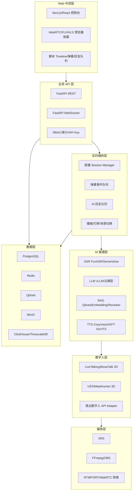

# 技术栈选型与 UI 对标参考

## 1. 推荐结论

本系统建议采用 **Web 中控 + Python AI 后端 + 独立数字人渲染服务 + 独立媒体网关** 的架构。

推荐主线：

- 前端：Next.js + React + TypeScript，做直播中控、资产管理、知识库、报表。
- 后端：FastAPI + PostgreSQL + Redis，做业务 API、实时 WebSocket、任务编排。
- AI：FunASR/SenseVoice + Qwen/DeepSeek/vLLM + Qdrant + CosyVoice/GPT-SoVITS。
- 数字人：MVP 用 LiveTalking + MuseTalk；投标级 3D 用 UE5 + MetaHuman/自定义扫描模型。
- 媒体：SRS + FFmpeg/OBS/Restreamer，支持 RTMP、SRT、WebRTC、多平台转推。
- 部署：开发期 Docker Compose，生产期按规模选择 Docker Compose 或 Kubernetes。

整体上不建议一开始做厚重桌面客户端。直播中控优先做 Web 版，后续如客户要求 Windows 桌面端，可用 Tauri/Electron 包一层。

## 2. 技术架构分层



## 3. 前端技术栈

### 3.1 主框架

| 技术 | 推荐 | 用途 | 选择理由 |
| --- | --- | --- | --- |
| Next.js | 必选 | Web 控制台、路由、SSR/CSR 混合 | 适合复杂后台和可扩展 Web 应用，App Router 生态成熟 |
| React | 必选 | UI 组件开发 | 生态成熟，适合高交互控制台 |
| TypeScript | 必选 | 类型系统 | 降低大型系统维护风险 |
| pnpm | 推荐 | 包管理 | monorepo 管理体验好，安装快 |

参考：

- Next.js App Router 文档：https://nextjs.org/docs/app
- Next.js TypeScript 文档：https://nextjs.org/docs/app/api-reference/config/typescript

### 3.2 UI 与交互

| 技术 | 推荐 | 用途 | 说明 |
| --- | --- | --- | --- |
| Tailwind CSS | 推荐 | 样式系统 | 快速构建设计系统，适合自定义播控风格 |
| Radix UI | 推荐 | 无样式基础组件 | Dialog、Popover、Tabs、Tooltip 等可访问性基础能力 |
| shadcn/ui | 可选 | 组件脚手架 | 只作为基础组件来源，不直接套默认风格 |
| Framer Motion / Motion | 推荐 | 页面动效 | 开播检查、场景切换、告警动画 |
| ECharts / AntV | 推荐 | 数据可视化 | 直播数据、延迟、互动趋势、报表 |
| dnd-kit | 推荐 | 拖拽 | 脚本 timeline、场景排序、播报队列排序 |
| React Flow | 可选 | 编排视图 | 如果要做可视化直播流程/AI 工作流，可引入 |

### 3.3 状态和数据请求

| 技术 | 推荐 | 用途 | 说明 |
| --- | --- | --- | --- |
| TanStack Query | 必选 | 服务端状态、缓存、请求重试 | 管理直播列表、资产、知识库、报表等异步数据 |
| Zustand | 推荐 | 客户端状态 | 管理当前直播控制台状态、选中场景、播放器状态 |
| XState | 可选 | 状态机 | 开播流程、推流状态、AI 播报状态复杂后再引入 |

参考：

- TanStack Query：https://tanstack.com/query/latest
- Zustand：https://zustand.docs.pmnd.rs/

### 3.4 实时播放和通信

| 技术 | 推荐 | 用途 | 说明 |
| --- | --- | --- | --- |
| WebSocket | 必选 | 弹幕、AI 回复、播报队列、推流状态 | 控制台实时事件主通道 |
| WebRTC | 必选 | 低延迟数字人预览 | 适合直播中控预览和低延迟互动 |
| mpegts.js / flv.js | 可选 | HTTP-FLV 播放 | 国内直播链路常用，兼容 SRS |
| hls.js | 可选 | HLS 播放 | 延迟高一些，适合回看和低实时要求 |

## 4. 后端技术栈

### 4.1 API 服务

| 技术 | 推荐 | 用途 | 选择理由 |
| --- | --- | --- | --- |
| Python | 必选 | 主后端和 AI worker | AI 生态最好，和模型服务集成成本低 |
| FastAPI | 必选 | REST API、WebSocket | 高性能、类型友好、OpenAPI 文档自动生成 |
| Pydantic | 必选 | 数据校验、Schema | FastAPI 原生生态，适合统一接口类型 |
| SQLAlchemy 2.x | 推荐 | ORM | 成熟、可控、适合复杂业务 |
| Alembic | 推荐 | 数据库迁移 | 管理数据库版本 |
| Uvicorn/Gunicorn | 推荐 | API 运行 | 标准 Python ASGI 部署方式 |

参考：

- FastAPI：https://fastapi.tiangolo.com/
- FastAPI WebSocket：https://fastapi.tiangolo.com/advanced/websockets/

### 4.2 实时编排和任务

| 技术 | MVP | 生产增强 | 用途 |
| --- | --- | --- | --- |
| Redis | 必选 | 必选 | 缓存、分布式锁、直播状态、短队列 |
| Redis Streams | 推荐 | 可保留 | 弹幕事件流、AI 回复事件流 |
| Celery / RQ / Arq | 推荐 | 可保留 | 文档解析、TTS、转码、报表等异步任务 |
| NATS JetStream | 可选 | 推荐 | 更强的实时事件总线和跨服务消息 |
| Kafka/Redpanda | 不建议 MVP | 大规模再考虑 | 超大规模事件流和数据管道 |

推荐策略：

- MVP 阶段：Redis + Arq/Celery 足够。
- 多直播间、多节点、事件量很大时：引入 NATS JetStream。
- 海量事件分析时：再引入 Kafka/Redpanda。

### 4.3 认证、权限和审计

| 技术/方案 | 推荐 | 用途 |
| --- | --- | --- |
| JWT + Refresh Token | 必选 | 登录态 |
| RBAC | 必选 | 管理员、运营、审核、技术支持、只读角色 |
| Casbin | 可选 | 复杂权限模型 |
| passkeys/MFA | 可选 | 高安全客户 |
| Vault/KMS | 生产推荐 | API Key、平台密钥、模型密钥加密 |
| 审计日志 | 必选 | 开播、停播、删除、人工接管、规则修改记录 |

## 5. AI 技术栈

## 5.1 ASR 语音识别

| 技术 | 推荐级别 | 用途 | 说明 |
| --- | --- | --- | --- |
| FunASR | 首选 | 中文流式识别、热词、标点、WebSocket ASR | 工业级开源 ASR，适合私有化和中文场景 |
| SenseVoice | 推荐 | 多语种、情绪、语音事件识别 | 可增强直播情绪识别和复杂音频理解 |
| 云厂商 ASR | 兜底 | 商用 SLA 或特殊客户要求 | 对准确率/SLA 有硬要求时接入 |

参考：

- FunASR GitHub：https://github.com/modelscope/FunASR
- FunASR WebSocket 示例：https://github.com/modelscope/FunASR/blob/main/runtime/python/websocket/README.md

## 5.2 LLM 与 RAG

| 技术 | 推荐级别 | 用途 | 说明 |
| --- | --- | --- | --- |
| Qwen/DeepSeek 等本地模型 | 推荐 | 私有化问答、话术生成 | 国内中文效果好，可控性强 |
| vLLM | 推荐 | 本地模型服务 | 提供 OpenAI-compatible API，便于统一接入 |
| Dify | 可选 | 快速搭建工作流/RAG/Agent 管理台 | 适合早期原型和运营配置型工作流 |
| Qdrant | 推荐 | 向量检索 | 部署简单、过滤能力强、适合知识库 |
| Milvus | 可选 | 大规模向量检索 | 超大规模知识库再考虑 |
| pgvector | 可选 | 小规模知识库 | 简化架构，直接用 PostgreSQL |

推荐策略：

- MVP：Qdrant + 本地 Embedding + OpenAI-compatible LLM API。
- 内部低代码运营：可接 Dify 管理部分工作流。
- 核心产品能力：建议自研 RAG 流程，避免被 Dify 的数据结构和流程绑定。

参考：

- vLLM OpenAI-compatible server：https://docs.vllm.ai/en/stable/serving/online_serving/
- Dify GitHub：https://github.com/langgenius/dify
- Qdrant 文档：https://qdrant.tech/documentation/
- Qwen3 GitHub：https://github.com/qwenLM/qwen3

## 5.3 TTS 和声线克隆

| 技术 | 推荐级别 | 用途 | 说明 |
| --- | --- | --- | --- |
| CosyVoice | 首选 | 多语言/跨语言声线克隆、自然语音合成 | 中文和多语种能力较好，适合私有化 |
| GPT-SoVITS | 推荐 | 少样本声线克隆 | 社区成熟，便于快速验证 |
| EdgeTTS | MVP 可用 | 免费/低成本 TTS 测试 | 只适合 PoC，不适合商用核心声线 |
| 云厂商 TTS | 商用兜底 | SLA、音色授权、MOS 验收 | 投标和商用交付建议准备兜底 |

参考：

- CosyVoice GitHub：https://github.com/FunAudioLLM/CosyVoice
- GPT-SoVITS GitHub：https://github.com/RVC-Boss/GPT-SoVITS

## 5.4 内容安全和合规

| 技术/方案 | 推荐 | 用途 |
| --- | --- | --- |
| 本地敏感词库 | 必选 | 快速拦截明确违规内容 |
| LLM 风险分类器 | 推荐 | 判断灰色问题、金融/教育/医疗合规问题 |
| 平台规则库 | 必选 | 抖音/快手/淘宝/视频号规则差异化处理 |
| 人工确认队列 | 必选 | 高风险回复不直接播报 |
| 内容审计留痕 | 必选 | 回复内容、来源、操作者、风险命中记录 |

## 6. 数字人和渲染技术栈

## 6.1 MVP 数字人

| 技术 | 推荐 | 用途 | 说明 |
| --- | --- | --- | --- |
| LiveTalking | 首选 | 实时交互式流式数字人主框架 | 已包含 API、LLM/TTS 模块化、WebRTC/RTMP 输出思路 |
| MuseTalk | 推荐 | 高质量口型同步 | 作为 LiveTalking 的口型模型之一 |
| Wav2Lip | 可选 | 基础口型同步 | 质量低于新模型，但部署简单 |
| Ultralight-Digital-Human | 可选 | 轻量数字人 | 低成本验证 |

参考：

- LiveTalking GitHub：https://github.com/lipku/livetalking
- LiveTalking 文档：https://livetalking-doc.readthedocs.io/en/latest/usage.html
- MuseTalk GitHub：https://github.com/TMElyralab/MuseTalk

## 6.2 投标级 3D 数字人

| 技术 | 推荐 | 用途 | 说明 |
| --- | --- | --- | --- |
| UE5 | 首选 | 3D 实时渲染 | 适合 4K、HDR、实时灯光和高质量角色渲染 |
| MetaHuman | 推荐 | 快速获得高质量 3D 人物基础 | 可配合客户定制和面捕 |
| 自定义扫描模型 | 投标级必选 | 满足面数、形象、检测报告要求 | 高模用于检测，实时用低模 LOD |
| ARKit 52 BlendShapes | 推荐 | 52+ 微表情验收口径 | 适合表情清单和面捕标准化 |
| Live Link Face | 推荐 | iPhone 面捕到 UE | 低成本面捕方案 |
| Xsens/Rokoko/Noitom 等 | 商用可选 | 全身动捕 | 要求动作延迟和稳定性时采用 |
| NVIDIA Audio2Face | 可选 | 音频驱动表情 | 可作为 3D 音频表情生成备选 |
| Pixel Streaming/NDI/OBS | 推荐 | UE 输出到 Web/媒体网关 | 支持预览和推流链路 |

## 6.3 商业数字人 API Adapter

建议保留统一 Adapter，便于对接：

- 腾讯云智能数智人/腾讯云 AIGC 直播。
- 百度智能云曦灵。
- 阿里云虚拟数字人/3D 数字人实时对话。
- 华为云 MetaStudio。
- 其他第三方数字人厂商。

Adapter 内部统一成以下能力：

```http
POST /avatar/speak
POST /avatar/interrupt
POST /avatar/switch-outfit
POST /avatar/switch-scene
POST /avatar/start-stream
POST /avatar/stop-stream
GET  /avatar/status
```

## 7. 媒体与推流技术栈

| 技术 | 推荐级别 | 用途 | 说明 |
| --- | --- | --- | --- |
| SRS | 首选 | RTMP、WebRTC、SRT、HLS/HTTP-FLV 媒体网关 | 国内直播生态适配好，开源 MIT |
| FFmpeg | 必选 | 转码、合流、转推、录制 | 媒体基础工具 |
| OBS Studio | 推荐 | 直播画面合成、虚拟摄像头、人工接管 | 适合运营手动控制和兜底 |
| Restreamer | 可选 | 自托管多平台转推 | 快速验证多平台转推 |
| LiveKit | 可选 | 多人互动/WebRTC SFU | 如果后续要做多人连麦或实时互动房间再引入 |
| OvenMediaEngine | 可选 | 低延迟流媒体 | 注意 AGPL 许可，不建议默认商用内嵌 |

参考：

- SRS GitHub：https://github.com/ossrs/srs
- SRS RTMP 文档：https://ossrs.net/lts/en-us/docs/v6/doc/rtmp
- OBS 官网：https://obsproject.com/
- Restreamer GitHub：https://github.com/datarhei/restreamer

## 8. 数据库与存储技术栈

| 技术 | 推荐 | 用途 | 说明 |
| --- | --- | --- | --- |
| PostgreSQL | 必选 | 主业务数据库 | 用户、直播间、脚本、资产、话术、平台配置 |
| Redis | 必选 | 缓存、队列、直播状态 | 实时系统基础组件 |
| Qdrant | 推荐 | 向量数据库 | 知识库语义检索 |
| MinIO/S3 | 推荐 | 对象存储 | 模型、文档、音频、视频、检测报告 |
| ClickHouse | 可选 | 高吞吐分析 | 弹幕、日志、互动事件、指标分析 |
| TimescaleDB | 可选 | 时序数据 | 推流质量、延迟、GPU 指标 |

推荐策略：

- MVP：PostgreSQL + Redis + Qdrant + MinIO。
- 数据量上来后：增加 ClickHouse 存直播事件和互动明细。
- 如果不想太早引入 ClickHouse：先用 PostgreSQL 分区表承接。

## 9. 部署与运维技术栈

## 9.1 开发和测试环境

| 技术 | 推荐 | 用途 |
| --- | --- | --- |
| Docker Compose | 必选 | 本地一键启动依赖服务 |
| Makefile/Taskfile | 推荐 | 统一命令入口 |
| dotenv | 推荐 | 本地环境变量 |
| pre-commit | 推荐 | 提交前格式化和检查 |

## 9.2 生产部署

| 场景 | 推荐方案 |
| --- | --- |
| 单客户/单机房/小规模 | Docker Compose + systemd/supervisor + Nginx/Caddy |
| 多客户/多节点/GPU 集群 | Kubernetes + Helm + NVIDIA GPU Operator |
| Windows Server 要求 | 业务服务可 Windows 部署，AI 推理建议 Linux GPU 节点，数字人 UE 渲染节点可 Windows |
| 云上部署 | API/数据服务云上，GPU/渲染节点按成本选择云 GPU 或本地工作站 |

## 9.3 监控和日志

| 技术 | 推荐 | 用途 |
| --- | --- | --- |
| Prometheus | 必选 | 指标采集 |
| Grafana | 必选 | 监控面板 |
| Loki | 推荐 | 日志聚合 |
| OpenTelemetry | 推荐 | 链路追踪 |
| Sentry | 可选 | 前后端异常上报 |
| NVIDIA DCGM Exporter | GPU 节点推荐 | GPU 利用率、显存、温度、功耗 |

## 9.4 CI/CD 与质量

| 技术 | 推荐 | 用途 |
| --- | --- | --- |
| GitHub Actions/GitLab CI | 必选 | 自动测试和构建 |
| pytest | 必选 | Python 单元/集成测试 |
| ruff | 必选 | Python lint/format |
| mypy/pyright | 推荐 | Python 类型检查 |
| ESLint/Prettier | 必选 | 前端代码规范 |
| Vitest | 推荐 | 前端单元测试 |
| Playwright | 必选 | 中控 UI E2E 测试 |
| k6/Locust | 推荐 | API 和 WebSocket 压测 |

## 10. 目录结构建议

```text
apps/
  web/                  # Next.js 中控前端
  api/                  # FastAPI 业务 API

services/
  ai-worker/            # ASR/TTS/LLM/RAG worker
  avatar-worker/        # LiveTalking/MuseTalk 封装服务
  media-gateway/        # SRS/FFmpeg/OBS/Restreamer 配置
  platform-connectors/  # 抖音/快手/淘宝/视频号 Adapter

packages/
  shared-types/         # OpenAPI 生成的共享类型
  ui/                   # 自研 UI 组件库
  protocol/             # 直播事件、AI 事件、平台事件协议

infra/
  docker-compose.yml
  nginx/
  srs/
  monitoring/
  k8s/

docs/
  digital-human-live-system-plan.md
  technical-stack-and-ui-references.md
```

## 11. UI 设计方向

## 11.1 产品定位

本系统不是普通后台，也不是纯视频编辑器，而是 **AI 直播播控室**。

UI 应该同时满足：

- 运营人员能快速开播、插话、切场景、处理弹幕。
- 技术人员能看到延迟、GPU、推流、模型服务状态。
- 管理人员能查看报表、服务记录、风险审计。
- 客户能感知数字人资产、话术库、知识库、平台授权的价值。

## 11.2 主控制台布局

推荐采用四区布局：

```text
┌──────────────────────────────────────────────────────────────┐
│ 顶部状态栏：直播状态 / 平台状态 / 延迟 / 码率 / 一键停播       │
├───────────────┬──────────────────────────────┬───────────────┤
│ 场景与资产区   │ 数字人低延迟预览区             │ 弹幕与AI回复区 │
│ - 数字人       │ - WebRTC 预览                 │ - 待答问题     │
│ - 声线         │ - 商品卡/字幕/贴片             │ - 风险拦截     │
│ - 场景         │ - 人工接管提示                 │ - 人工确认     │
├───────────────┴──────────────────────────────┴───────────────┤
│ 底部 Timeline：脚本节点 / 商品节点 / 问答节点 / 场景切换节点   │
└──────────────────────────────────────────────────────────────┘
```

## 11.3 视觉风格

- 主色：石墨灰、钨金橙、信号绿、风险红。
- 背景：深浅可切换，但默认建议深色播控风格，突出视频预览和状态灯。
- 字体：中文使用阿里巴巴普惠体/鸿蒙 Sans；数字状态可用 Barlow Condensed。
- 动效：少而明确，开播检查逐项点亮、风险告警聚焦、场景切换有播控感。
- 图标：使用线性图标 + 状态色，不使用过多渐变 AI 风格图标。

## 11.4 页面规划

| 页面 | 核心内容 | UI 参考方向 |
| --- | --- | --- |
| 首页总览 | 当前直播、推流健康、AI 延迟、告警、今日数据 | 云控制台 + 直播状态面板 |
| 直播中控 | 数字人预览、弹幕、AI 回复、播报队列、Timeline | OBS/StreamYard/Restream Studio |
| 数字人资产 | 形象、服装、动作、声线、检测报告 | HeyGen/Synthesia/D-ID/国内数字人平台 |
| 脚本编排 | PPT/Word/Excel 解析、流程节点、预演 | 视频编辑器 + 直播流程编排 |
| 知识库 | 文档上传、分块、向量化、问答测试 | Dify/企业知识库后台 |
| 平台管理 | 账号授权、推流地址、弹幕权限、回调配置 | Restream/云直播控制台 |
| 风险审核 | 风险命中、人工确认、禁用词、审计 | 内容安全审核台 |
| 报表中心 | 直播复盘、月报、SLA、训练记录 | BI 看板 + 服务报告 |

## 12. 对标产品官网与 UI 参考

以下产品建议主要参考信息架构、核心交互和视觉呈现，不建议直接照搬。

## 12.1 AI 数字人视频/资产编辑类

| 产品 | 官网 | 可参考点 |
| --- | --- | --- |
| HeyGen | https://www.heygen.com/ | 头像选择、脚本输入、模板化视频生成、声音与语言切换 |
| HeyGen Avatars | https://www.heygen.com/avatars | Avatar 市场、形象卡片、生成入口、营销落地页表现 |
| Synthesia | https://www.synthesia.io/ | 企业级 AI 视频平台、Avatar/语言/模板组织方式 |
| Synthesia Avatars | https://www.synthesia.io/features/avatars | Avatar 库、个人 Avatar、语言和场景展示 |
| D-ID Creative Reality Studio | https://www.d-id.com/creative-reality-studio/ | 从图片/文本/音频生成数字人视频的轻量流程 |
| D-ID Studio | https://studio.d-id.com/ | 简洁的 Studio 入口和内容生成交互 |

### 对本系统的启发

- 数字人资产页要做成“形象卡片 + 状态 + 快速预览 + 快速绑定声线”。
- 话术输入和视频预演要尽量简单，运营人员不应看到复杂模型参数。
- 模板化是降低使用门槛的核心：行业模板、直播场景模板、话术模板都要卡片化。

## 12.2 实时对话数字人/视频 Agent 类

| 产品 | 官网 | 可参考点 |
| --- | --- | --- |
| Tavus | https://www.tavus.io/ | 实时视频 Agent、低延迟对话、人设和感知能力表达 |
| Tavus CVI | https://www.tavus.io/cvi | Conversational Video Interface 的产品包装和实时对话概念 |
| Tavus Docs CVI | https://docs.tavus.io/sections/conversational-video-interface/overview-cvi | 实时多模态视频交互的 API/开发者体验 |

### 对本系统的启发

- 对话链路需要显示“听到什么、理解什么、准备说什么、正在说什么”。
- 延迟是核心体验指标，UI 要把 ASR、LLM、TTS、渲染、推流分段展示。
- 人设/行为策略可以独立成配置，不要写死在提示词里。

## 12.3 直播中控/多平台推流类

| 产品 | 官网 | 可参考点 |
| --- | --- | --- |
| StreamYard | https://streamyard.com/ | 浏览器直播间、嘉宾/场景/品牌元素/聊天管理 |
| Restream | https://restream.io/ | 多平台目的地管理、转推状态、统一聊天 |
| Restream Studio | https://restream.io/integrations/restream-studio/ | 浏览器 Studio、多平台直播、品牌和聊天管理 |
| OBS Studio | https://obsproject.com/ | 场景、来源、音频混音、推流控制的专业播控范式 |
| Streamlabs | https://streamlabs.com/ | 面向主播的控制台、插件、告警、叠加层 |

### 对本系统的启发

- 直播中控页应借鉴 OBS 的“场景/来源/音频/推流状态”，但降低复杂度。
- 多平台管理应借鉴 Restream：平台卡片、连接状态、推流开关、错误提示。
- 浏览器直播间应借鉴 StreamYard：清晰的大预览、右侧互动、顶部开播状态。

## 12.4 国内数字人/云服务类

| 产品 | 官网/文档 | 可参考点 |
| --- | --- | --- |
| 腾讯云数字人 | https://avatar.cloud.tencent.com/ | 在线数字人视频创作、素材、剪辑、渲染发布 |
| 腾讯云智能数智人 | https://www.tencentcloud.com/zh/products/ivh | 虚拟形象播报、实时语音交互、3D 数智人生产流程 |
| 腾讯云 AIGC 直播 | https://cloud.tencent.com/document/product/267/123874 | AIGC 直播间创建、复制、重命名、管理逻辑 |
| 百度智能云曦灵 | https://xiling.cloud.baidu.com/ | 电商营销、短视频、AI 直播、数字员工能力组合 |
| 阿里云虚拟数字人 | https://www.aliyun.com/product/ai/avatar | 2D/3D 数字人、视频合成、实时交互和直播场景 |
| 阿里云 3D 数字人实时对话 | https://help.aliyun.com/zh/avatar/avatar-application/user-guide/avatar-3dchat | ASR、TTS、LLM、数字人驱动整合式实时对话思路 |
| 华为云 MetaStudio | https://www.huaweicloud.com/product/mdh.html | 数字人视频制作、直播、智能交互、企业代言 |

### 对本系统的启发

- 国内客户更看重“一站式”和“能不能直播带货”，UI 要突出业务闭环，而不是模型技术。
- 直播间管理要有“创建、复制、重命名、删除、模板复用”。
- 数字人能力要和电商商品库、话术库、平台账号直接关联。
- 商用版本需要突出授权、服务、检测报告、训练记录和交付材料。

## 13. 推荐的 UI 原型优先级

### P0：直播中控主界面

必须先做，因为它决定产品的核心体验。

包含：

- 数字人预览。
- 开播/停播。
- 平台状态。
- 弹幕列表。
- AI 回复队列。
- 人工确认。
- 脚本 timeline。
- 一键静音/停播/人工接管。

### P1：数字人资产页

包含：

- 数字人卡片列表。
- 声线绑定。
- 服装/发型/动作。
- 检测报告。
- 预览和测试播报。

### P1：知识库和话术库

包含：

- 文档上传。
- 解析进度。
- 分块结果。
- 问答测试。
- 话术模板分类。
- 风险词库。

### P2：平台管理

包含：

- 平台账号。
- 推流地址。
- 弹幕权限。
- 多平台开关。
- 错误和重连状态。

### P2：报表中心

包含：

- 直播复盘。
- 互动统计。
- AI 回复质量。
- SLA 和故障记录。
- 月度报告导出。

## 14. MVP 技术组合

如果现在开始开发，第一版建议这样选：

| 层 | MVP 选择 |
| --- | --- |
| 前端 | Next.js + React + TypeScript + Tailwind + Radix UI + TanStack Query + Zustand |
| 后端 | FastAPI + Pydantic + SQLAlchemy + PostgreSQL + Redis |
| AI 问答 | Qwen/云模型 OpenAI-compatible API + Qdrant + Embedding/Reranker |
| ASR | FunASR |
| TTS | CosyVoice 或 GPT-SoVITS，PoC 可先 EdgeTTS |
| 数字人 | LiveTalking + MuseTalk/Wav2Lip |
| 媒体 | SRS + FFmpeg，必要时配 OBS |
| 文件 | MinIO |
| 部署 | Docker Compose |
| 监控 | Prometheus + Grafana，MVP 可后置 |
| 测试 | pytest + Vitest + Playwright |

## 15. 商用增强技术组合

| 层 | 商用增强 |
| --- | --- |
| 数字人 | 接腾讯云/百度/阿里/华为数字人 API，或 UE5 3D 渲染节点 |
| 媒体 | SRS 独立节点，多平台推流隔离，录制和回放 |
| 事件总线 | NATS JetStream |
| 数据分析 | ClickHouse |
| 监控 | Prometheus + Grafana + Loki + OpenTelemetry |
| 密钥 | Vault/KMS |
| 部署 | 多节点 Docker Compose 或 Kubernetes |
| 服务 | SLA 工单、月报、季度更新、培训记录 |

## 16. 不建议的选择

| 选择 | 不建议原因 | 替代方案 |
| --- | --- | --- |
| 一开始做厚重桌面客户端 | 开发慢、升级难、远程支持成本高 | 先做 Web 控制台，后续 Tauri/Electron 包装 |
| 所有模块都用 Java/Spring | AI 模型集成成本高，实时媒体生态不如 Python/Go/C++直接 | 后端主服务用 FastAPI，必要时企业集成再加 Java 网关 |
| 过早上 Kubernetes | MVP 阶段复杂度过高 | 先 Docker Compose，规模上来后迁移 |
| 只依赖单一数字人厂商 | 供应商锁定和价格风险 | 保留统一 Adapter，开源和商业 API 双路径 |
| 逆向平台弹幕/接口 | 合规风险高，容易封禁 | 官方开放平台/服务商能力/弹幕模拟器 |
| 把高模直接用于实时渲染 | 性能不可控 | 高模检测归档，实时渲染用低模 LOD |

## 17. 下一步建议

1. 先按 MVP 技术组合初始化工程。
2. 先做直播中控主界面静态原型。
3. 并行跑通 LiveTalking + TTS + SRS 的文本播报链路。
4. 再接入 FunASR + RAG，实现弹幕问答闭环。
5. 最后根据客户/投标要求选择商业数字人 API 或 UE5 3D 路线。
